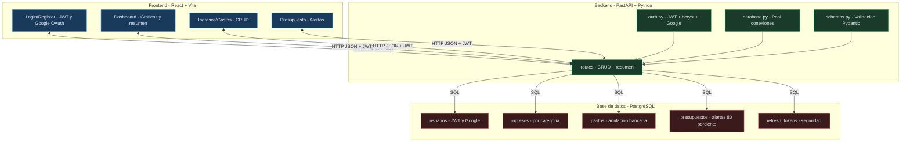

# 💹 Finanzas Dashboard

Dashboard de finanzas personales con autenticación JWT y Google OAuth.


---

## 🚀 Tecnologías

- **Backend:** Python · FastAPI · uvicorn
- **Base de datos:** PostgreSQL · psycopg2 · pool de conexiones
- **Autenticación:** JWT · bcrypt · Google OAuth
- **Frontend:** React · Vite · Axios · Recharts · React Router
- **Deploy:** Render (backend + DB) · Netlify (frontend)
- **Otros:** python-dotenv · Pydantic · passlib

---

## 📁 Estructura del proyecto

```
finanzas-dashboard/
├── backend/
│   ├── main.py              # Entrada de la app FastAPI
│   ├── database.py          # Pool de conexiones PostgreSQL
│   ├── models.py            # Modelos de datos y categorías
│   ├── schemas.py           # Validaciones Pydantic
│   ├── auth.py              # JWT, bcrypt y Google OAuth
│   └── routes/
│       ├── auth.py          # Registro, login, logout, Google
│       ├── ingresos.py      # CRUD ingresos
│       ├── gastos.py        # CRUD gastos con anulación bancaria
│       ├── presupuesto.py   # Presupuesto mensual con alertas
│       └── resumen.py       # Dashboard y resumen anual
├── frontend/
│   └── src/
│       ├── components/      # Navbar, PrivateRoute, gráficos
│       ├── pages/           # Login, Register, Dashboard, etc.
│       ├── services/        # Axios + interceptores JWT
│       └── context/         # AuthContext global
├── docs/
│   └── images/
├── .gitignore
└── README.md
```

---

## 🗄️ Base de datos

```sql
-- Usuarios con soporte JWT y Google OAuth
CREATE TABLE usuarios (
    id SERIAL PRIMARY KEY,
    nombre VARCHAR(100) NOT NULL,
    email VARCHAR(150) UNIQUE NOT NULL,
    password_hash VARCHAR(255),
    google_id VARCHAR(255),
    avatar_url VARCHAR(500),
    proveedor VARCHAR(20) DEFAULT 'local',
    activo BOOLEAN DEFAULT TRUE,
    created_at TIMESTAMP DEFAULT CURRENT_TIMESTAMP
);

-- Ingresos por categoría
CREATE TABLE ingresos (
    id SERIAL PRIMARY KEY,
    usuario_id INTEGER REFERENCES usuarios(id) ON DELETE CASCADE,
    descripcion VARCHAR(255),
    monto DECIMAL(12,2) NOT NULL,
    categoria VARCHAR(100) NOT NULL,
    fecha DATE NOT NULL,
    recurrente BOOLEAN DEFAULT FALSE,
    created_at TIMESTAMP DEFAULT CURRENT_TIMESTAMP
);

-- Gastos con anulación bancaria
CREATE TABLE gastos (
    id SERIAL PRIMARY KEY,
    usuario_id INTEGER REFERENCES usuarios(id) ON DELETE CASCADE,
    descripcion VARCHAR(255),
    monto DECIMAL(12,2) NOT NULL,
    categoria VARCHAR(100) NOT NULL,
    subcategoria VARCHAR(100),
    fecha DATE NOT NULL,
    recurrente BOOLEAN DEFAULT FALSE,
    anulado BOOLEAN DEFAULT FALSE,
    created_at TIMESTAMP DEFAULT CURRENT_TIMESTAMP
);

-- Presupuesto mensual por categoría
CREATE TABLE presupuestos (
    id SERIAL PRIMARY KEY,
    usuario_id INTEGER REFERENCES usuarios(id) ON DELETE CASCADE,
    categoria VARCHAR(100) NOT NULL,
    monto_limite DECIMAL(12,2) NOT NULL,
    mes INTEGER NOT NULL,
    anio INTEGER NOT NULL,
    UNIQUE(usuario_id, categoria, mes, anio)
);

-- Gastos recurrentes
CREATE TABLE gastos_recurrentes (
    id SERIAL PRIMARY KEY,
    usuario_id INTEGER REFERENCES usuarios(id) ON DELETE CASCADE,
    descripcion VARCHAR(255) NOT NULL,
    monto DECIMAL(12,2) NOT NULL,
    categoria VARCHAR(100) NOT NULL,
    dia_del_mes INTEGER NOT NULL,
    activo BOOLEAN DEFAULT TRUE,
    created_at TIMESTAMP DEFAULT CURRENT_TIMESTAMP
);

-- Refresh tokens
CREATE TABLE refresh_tokens (
    id SERIAL PRIMARY KEY,
    usuario_id INTEGER REFERENCES usuarios(id) ON DELETE CASCADE,
    token VARCHAR(500) NOT NULL,
    expira_en TIMESTAMP NOT NULL,
    creado_en TIMESTAMP DEFAULT CURRENT_TIMESTAMP
);
```

---

## 🔌 Endpoints

### Autenticación
| Método | Ruta | Descripción | Auth |
|--------|------|-------------|------|
| POST | `/auth/register` | Registro con email y contraseña | ❌ |
| POST | `/auth/login` | Login → JWT + refresh token | ❌ |
| POST | `/auth/google` | Login con Google OAuth | ❌ |
| POST | `/auth/refresh` | Renovar access token | ❌ |
| POST | `/auth/logout` | Cerrar sesión | ✅ |
| GET | `/auth/me` | Datos del usuario actual | ✅ |

### Ingresos
| Método | Ruta | Descripción | Auth |
|--------|------|-------------|------|
| GET | `/ingresos` | Listar ingresos con filtros | ✅ |
| POST | `/ingresos` | Crear ingreso | ✅ |
| PUT | `/ingresos/{id}` | Actualizar ingreso | ✅ |
| DELETE | `/ingresos/{id}` | Eliminar ingreso | ✅ |

### Gastos
| Método | Ruta | Descripción | Auth |
|--------|------|-------------|------|
| GET | `/gastos` | Listar gastos con filtros | ✅ |
| POST | `/gastos` | Crear gasto | ✅ |
| PUT | `/gastos/{id}` | Actualizar gasto | ✅ |
| DELETE | `/gastos/{id}` | Anular gasto (no elimina) | ✅ |

### Presupuesto
| Método | Ruta | Descripción | Auth |
|--------|------|-------------|------|
| GET | `/presupuesto` | Ver presupuestos con alertas | ✅ |
| POST | `/presupuesto` | Crear o actualizar presupuesto | ✅ |
| DELETE | `/presupuesto/{id}` | Eliminar presupuesto | ✅ |

### Resumen
| Método | Ruta | Descripción | Auth |
|--------|------|-------------|------|
| GET | `/resumen/mes` | Dashboard del mes actual | ✅ |
| GET | `/resumen/anual` | Resumen de los 12 meses | ✅ |

Documentación interactiva disponible en `http://127.0.0.1:8000/docs`

---

## 🏗️ Arquitectura



---

## 🔐 Seguridad

- Contraseñas hasheadas con **bcrypt** — nunca en texto plano
- **JWT** con expiración corta (30 min) + refresh token (7 días)
- Refresh tokens almacenados en DB — invalidación en logout
- Mensajes de error genéricos — no revela si un email existe
- Gastos con **anulación** en vez de eliminación — historial inmutable
- Pool de conexiones con límite máximo — protección contra sobrecarga
- CORS configurado por dominio específico en producción

---

## ✨ Funcionalidades

- Registro y login con email/contraseña o Google OAuth
- Dashboard con resumen del mes: ingresos, gastos, balance y % ahorro
- Gráficos de gastos por categoría y evolución mensual
- Filtros por mes, año y categoría
- Presupuesto mensual por categoría con alertas al 80%
- Comparativa con el mes anterior
- Proyección del gasto mensual
- Resumen anual con detalle mes a mes
- Historial inmutable — criterio bancario profesional

---

## ⚙️ Instalación y uso

### 1. Clonar el repositorio

```bash
git clone https://github.com/GustavoRodriguez79/finanzas-dashboard.git
cd finanzas-dashboard
```

### 2. Configurar el backend

```bash
cd backend
python -m venv venv
source venv/Scripts/activate  # Windows
pip install -r requirements.txt
```

### 3. Configurar variables de entorno

Crear `backend/.env`:

```
DB_HOST=localhost
DB_PORT=5432
DB_NAME=finanzas_dashboard
DB_USER=postgres
DB_PASSWORD=tu_contraseña

SECRET_KEY=clave_secreta_minimo_32_caracteres
ALGORITHM=HS256
ACCESS_TOKEN_EXPIRE_MINUTES=30
REFRESH_TOKEN_EXPIRE_DAYS=7

GOOGLE_CLIENT_ID=tu_google_client_id
GOOGLE_CLIENT_SECRET=tu_google_client_secret

ENVIRONMENT=development
```

### 4. Correr el servidor

```bash
cd backend
uvicorn main:app --reload
```

---

## 🌐 Deploy

- **Backend:** [Render](https://render.com) — Python + PostgreSQL
- **Frontend:** [Netlify](https://netlify.com) — React + Vite

---

## 👤 Autor

**Gustavo Ariel Rodriguez**
Tecnicatura Universitaria en Programación — UTN San Rafael
[GitHub](https://github.com/GustavoRodriguez79) · [LinkedIn](https://www.linkedin.com/in/gustavo-ariel-rodr%C3%ADguez-fornes-36a899370/) · [garodrifornes79@gmail.com](mailto:garodrifornes79@gmail.com)